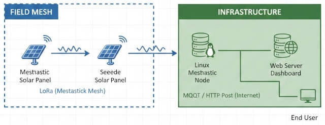

 

# WaveRider

This project is almost identical to 🌐 **Website:** [compdecon.github.io](https://compdecon.github.io/waverider). The difference is the processor. This project uses the [WisBlock Meshtastic Starter Kit - RAK4631 - nRF52840 - US915MHz] (https://store.rakwireless.com/products/wisblock-meshtastic-starter-kit?index=6), also we will recompile the Mestastic firmware to include an I2C distance measuring and BMP280 sensor. We are expecting that this will allow us to setup a Solar powered Meshtatic node.

# Goals

Measure, process and record tide heights, tide directions, solar, moon conditions and weather conditions. Information about the tide direction, moon and local weather will be recorded from an external source. We will record node localized weather adn power related information to manage the maintain the node.

# Sensors

This is a tentative list at this moment. They all need to be I2C and can share a data bus.

- clock/calendar
- Solar (IR, UV, lux, etc.)
- Environment Sensors: BME680 or BMP280
- Power Monitors: INA219 or INA260
- water temperature
- distance

 
Tidal sensor using Meshtastic to share data

 

 
